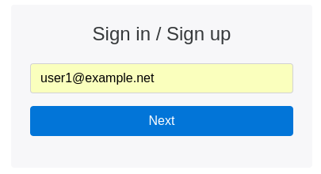

# EasyLogin.elm

**Status: alpha**

A small app providing a user-friendly way to sign up and sign in.

## Rationale

Passwords suck. People always forget them. Even worse, tech-illiterate users can't type them without typos.
And until [U2F](https://en.wikipedia.org/wiki/Universal_2nd_Factor) or something similar takes over the web, we're stuck with them. So this is an experiment to make them easier to use. Actually, it's mostly an excuse to play around with Elm but whatever :P

## Features

- start with a single email field (a la Google)
- if the email doesn't exist, create account automatically (con: allows account enumeration)
- if the email does exist, ask for password
- if the user can't remember their password, provide an obvious button to send a login link by email (a la Medium)

## Usage

See [example/index.html](example/index.html)

## License

MIT
